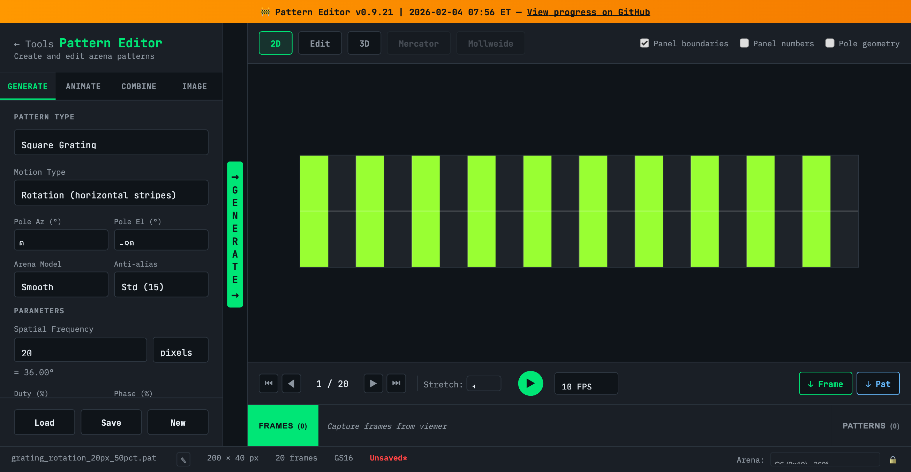
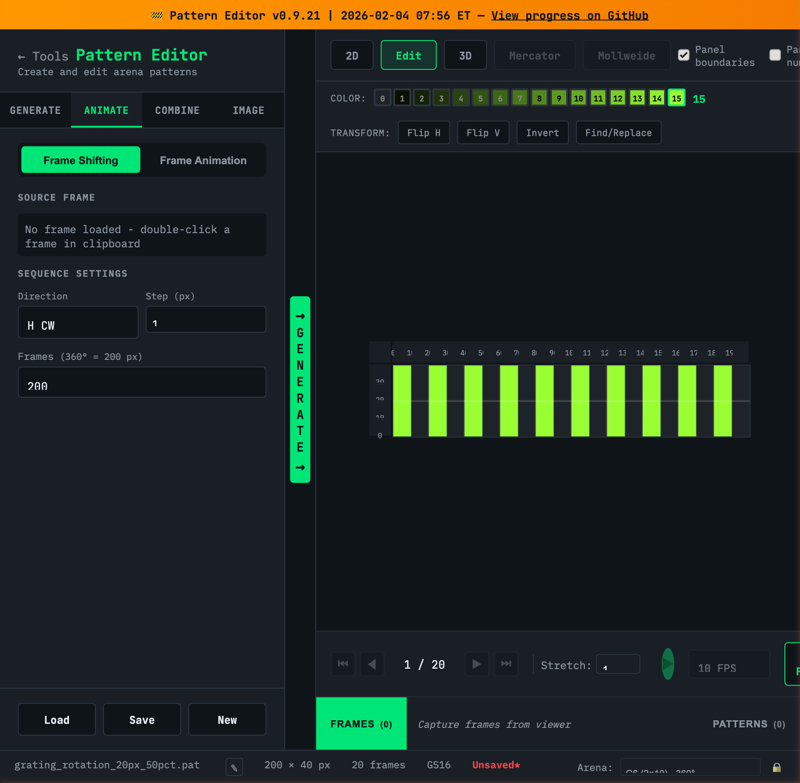
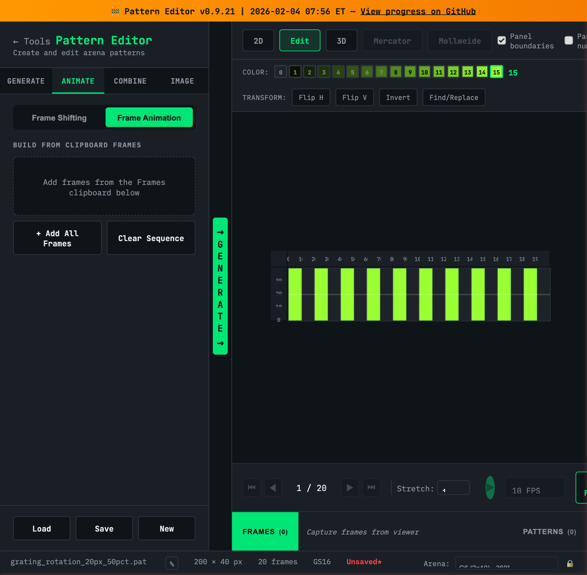
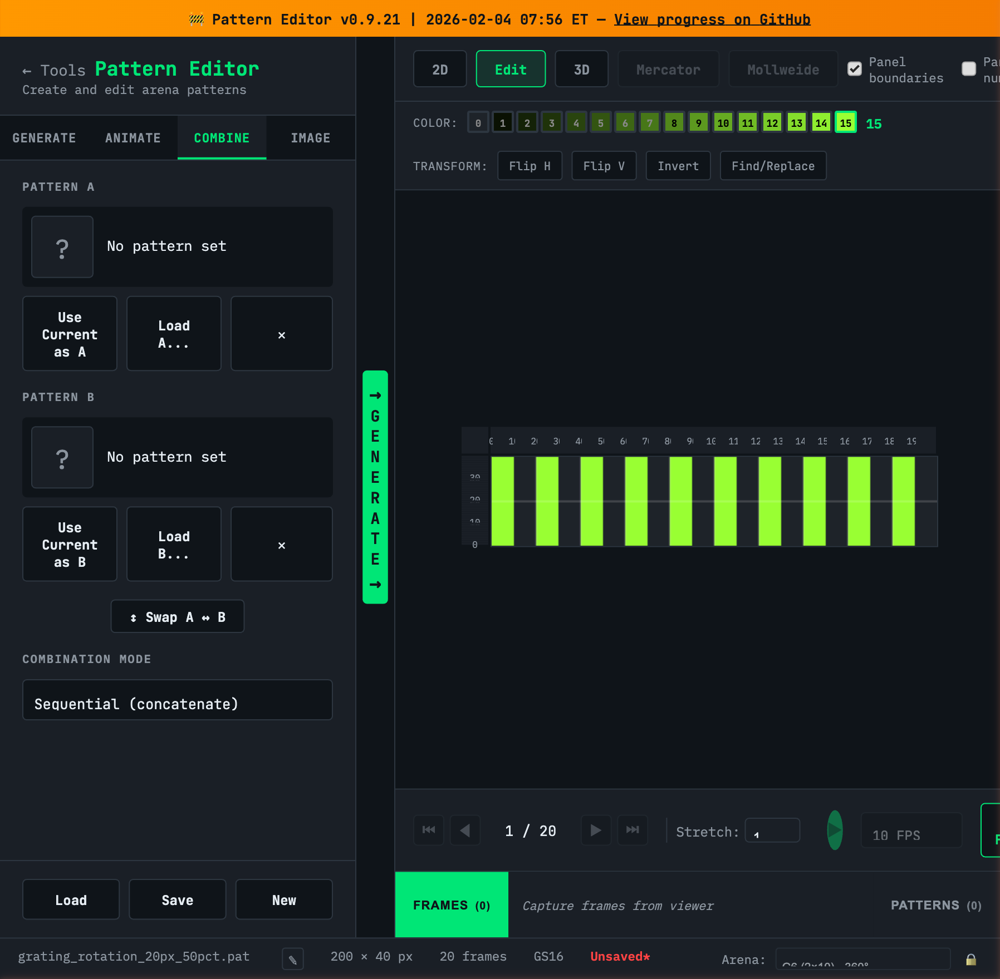
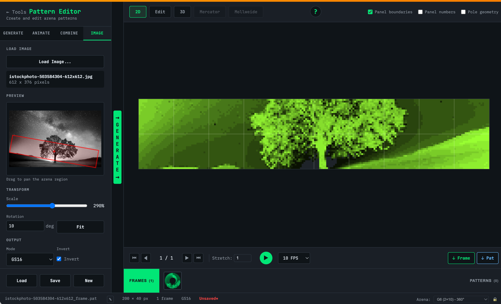
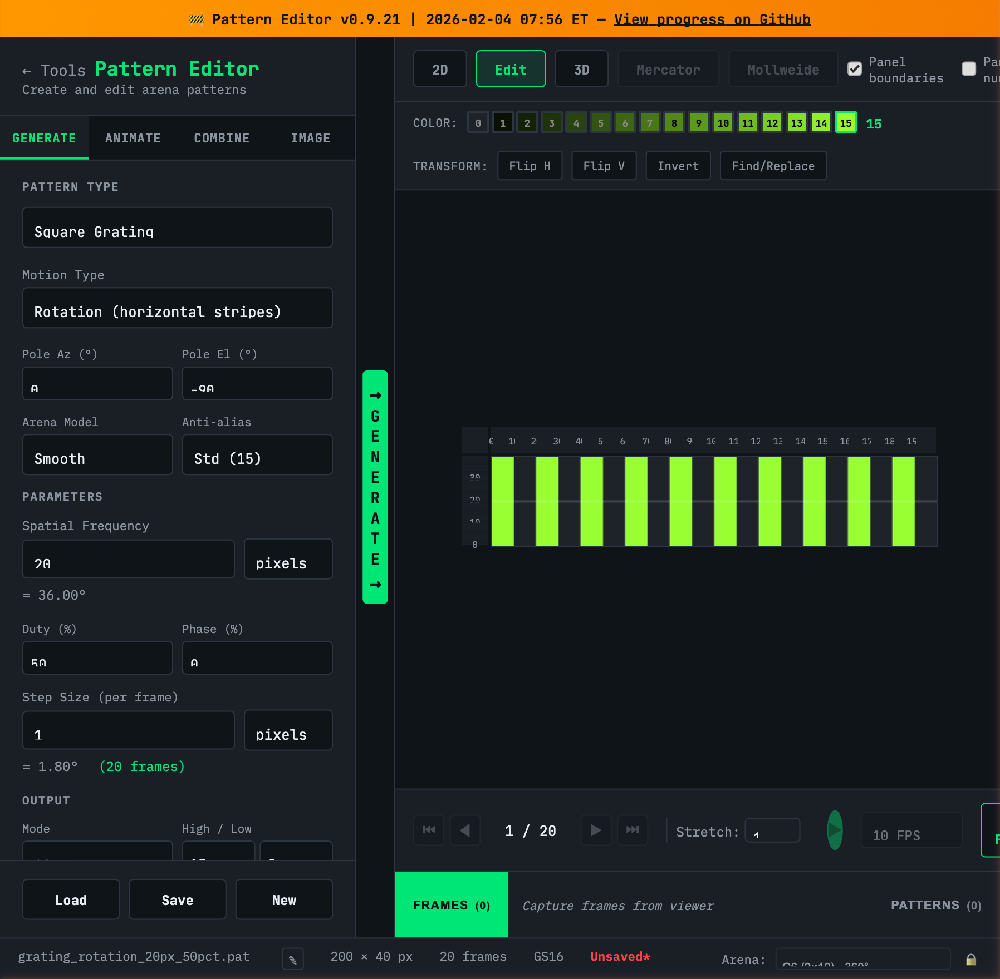
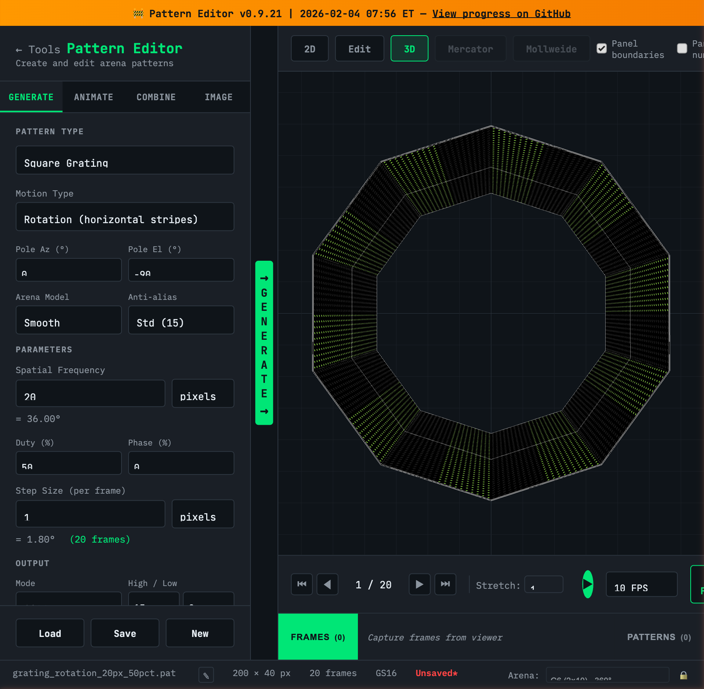

# Pattern Editor Quick Start

**Based on Pattern Editor v0.9.21**

The Pattern Editor is a web-based tool for creating and editing arena display patterns. This guide covers all controls and common workflows.

**[Launch Pattern Editor](https://reiserlab.github.io/webDisplayTools/pattern_editor.html)**

> **Found a bug?** [Report it](https://github.com/reiserlab/webDisplayTools/issues/new?assignees=mbreiser&labels=bug&title=%5BBug%5D+Pattern+Editor:+) | **Have an idea?** [Request a feature](https://github.com/reiserlab/webDisplayTools/issues/new?assignees=mbreiser&labels=enhancement&title=%5BFeature%5D+Pattern+Editor:+)

---

## Interface Overview

The Pattern Editor has a two-panel layout:

### Left Panel: Tools
- **Tool Tabs** (Generate, Animate, Combine, Image) - Different ways to create patterns
- **Parameters** - Settings specific to each tool
- **File Operations** (Load, Save, New) - Manage .pat files

### Center: Generate Button
- The large green **GENERATE** button creates a pattern from your current settings
- Click it after adjusting parameters to see your pattern in the viewer

### Right Panel: Viewer
- **Viewer Tabs** (2D, Edit, 3D, Mercator, Mollweide) - Different ways to visualize patterns
- **Display Options** - Toggle panel boundaries, numbers, pole geometry
- **Playback Controls** - Navigate frames, play animation, adjust FPS
- **Capture Buttons** - "↓ Frame" captures current frame, "↓ Pat" captures entire pattern

### Bottom: Clipboard & Status
- **Clipboard Bar** - Stores captured frames and patterns for later use
- **Status Bar** - Shows pattern info (filename, dimensions, frames, grayscale mode) and arena selection

---

## Generate Tab

Create patterns mathematically using spherical coordinate transformations.

### Common Workflow
1. Select a **Pattern Type** (Square Grating, Sine Grating, Starfield, Edge, or Off/On)
2. Choose **Motion Type** to set how the pattern wraps (Rotation, Expansion, or Translation)
3. Adjust **Spatial Frequency** and other parameters
4. Set **Step Size** to control animation speed (shown as frame count in green)
5. Click **GENERATE** to create the pattern
6. Preview with playback controls, then **Save** or capture to clipboard

### Pattern Types

| Type | Description |
|------|-------------|
| **Square Grating** | Sharp on/off stripes with configurable duty cycle |
| **Sine Grating** | Smooth sinusoidal intensity variation |
| **Starfield** | Random dot field for optic flow experiments |
| **Edge** | Single edge that sweeps across duty cycle range |
| **Off/On** | Static all-off or all-on single frame |

### Key Parameters

| Parameter | Description |
|-----------|-------------|
| **Motion Type** | `Rotation` (horizontal stripes), `Expansion` (concentric rings), `Translation` (linear motion) |
| **Pole Az/El** | Position of pattern pole (-180 to +180°, -90 to +90°) |
| **Spatial Frequency** | Wavelength in pixels or degrees (auto-converts) |
| **Duty (%)** | On-fraction for gratings (1-99%) |
| **Step Size** | Animation speed - pixels or degrees per frame |
| **Mode** | `GS16` (16 levels) or `GS2` (binary) |

---

## Animate Tab

Build animated patterns from captured frames.

### Frame Shifting Mode

Creates animation by shifting a single frame horizontally or vertically.

**Workflow:**
1. Generate or load a pattern with a static frame you want to animate
2. Click **↓ Frame** to capture it to the clipboard
3. Switch to **ANIMATE** tab, select **Frame Shifting**
4. Double-click the frame in the clipboard to load it as source
5. Choose **Direction** (H CW, H CCW, V Up, V Down)
6. Set **Step** size and total **Frames**
7. Click **GENERATE** to create the animated pattern

### Frame Animation Mode

Builds a sequence from multiple frames in the clipboard.

**Workflow:**
1. Create different static frames (generate patterns, edit them, etc.)
2. Capture each frame to clipboard with **↓ Frame**
3. Switch to **ANIMATE** tab, select **Frame Animation**
4. Click **+ Add All Frames** or drag individual frames into the sequence
5. Reorder frames as needed
6. Click **GENERATE** to create the animated pattern

---

## Combine Tab

Merge two patterns together using various blend modes.

### Workflow
1. Generate or load your first pattern
2. Click **Use Current as A** to capture it
3. Generate or load your second pattern
4. Click **Use Current as B** to capture it
5. Select a **Combination Mode**
6. Adjust mode-specific settings (threshold, split position)
7. Click **GENERATE** to create the combined pattern

### Combination Modes

| Mode | Description |
|------|-------------|
| **Sequential** | Concatenates A then B (A's frames followed by B's) |
| **Mask** | Shows B where A exceeds threshold (0-15) |
| **Blend** | Averages A and B pixel values (50/50) |
| **Horizontal Split** | Left portion from A, right from B |
| **Vertical Split** | Top portion from A, bottom from B |

---

## Image Tab

Convert raster images to arena patterns.

### Workflow
1. Click **Load Image...** to select a PNG or JPEG
2. Use the preview to position the image - drag to pan
3. Adjust **Scale** (10-500%) and **Rotation** (-180 to +180°)
4. Click **Fit** to automatically fit the arena to image bounds
5. Choose output **Mode** (GS16 or GS2) and optionally **Invert**
6. Click **GENERATE** to create the pattern

---

## Edit Mode

Interactive pixel editing for fine-tuning patterns.

### Workflow
1. Generate or load a pattern
2. Click the **Edit** viewer tab
3. Select a color from the palette (0-15 grayscale)
4. Click pixels in the viewer to paint with the selected color
5. **Tip:** Click on row numbers (left) or column numbers (top) to paint the entire row or column at once
6. Use transform buttons for bulk operations:
   - **Flip H/V** - Mirror horizontally or vertically
   - **Invert** - Invert all pixel values
   - **Find/Replace** - Replace all pixels of one value with another

---

## 3D View

Interactive visualization of the pattern on a cylindrical arena.

- **Orbit** - Click and drag to rotate the view
- **Zoom** - Scroll to zoom in/out
- **Pan** - Right-click and drag to pan
- Use playback controls to animate the pattern in 3D

---

## Playback Controls

Located at the bottom of the viewer:

| Control | Function |
|---------|----------|
| **⏮ ◀ ▶ ⏭** | First, previous, next, last frame |
| **Frame Counter** | Shows current / total frames |
| **Play Button** | Start/stop animation |
| **FPS** | Playback speed (-30 to +30, negative = reverse) |
| **Stretch** | Vertical display stretch (1-255) |

---

## Clipboard

The clipboard stores frames and patterns for building sequences and combining.

### Two Tabs
- **FRAMES** - Single frames for editing, animation building, or reference
- **PATTERNS** - Complete multi-frame patterns for combining

### Capturing
- **↓ Frame** - Captures the current frame to the Frames clipboard
- **↓ Pat** - Captures the entire pattern to the Patterns clipboard

### Using Clipboard Items
- **Click** an item to preview it
- **Double-click** a frame to load it as the Frame Shifting source
- **Hover** to reveal the delete (X) button

> **Note:** Clipboard contents are cleared when changing the arena configuration.

---

## File Operations

### Buttons
| Button | Function |
|--------|----------|
| **Load** | Open a .pat file from disk |
| **Save** | Save current pattern as .pat file |
| **New** | Create a blank pattern |

### Status Bar
The bottom bar shows:
- Pattern filename (click ✎ to rename)
- Dimensions (width × height pixels)
- Frame count
- Grayscale mode (GS16/GS2)
- Red asterisk (✱) indicates unsaved changes

### Arena Selection
- Use the dropdown to select target arena configuration
- Click the lock (🔒) to prevent accidental changes
- **Warning:** Changing arena clears the clipboard

---

## Tips

- **Automatic conversion**: Spatial frequency shows pixel↔degree conversion automatically
- **Frame count preview**: Shown in green next to Step Size
- **Keyboard navigation**: Use arrow keys for frame-by-frame when viewer is focused
- **Lock your arena**: Prevents accidental configuration changes mid-session
- **Save often**: The red asterisk reminds you of unsaved changes

---

## Version History

| Version | Date | Notes |
|---------|------|-------|
| v0.9.21 | 2026-02-04 | Current version documented in this guide |

See the [Pattern Editor changelog](https://github.com/reiserlab/webDisplayTools/commits/main/pattern_editor.html) for detailed version history.

---

*Guide by Michael Reiser & Claude | [View on GitHub](https://github.com/reiserlab/webDisplayTools)*
