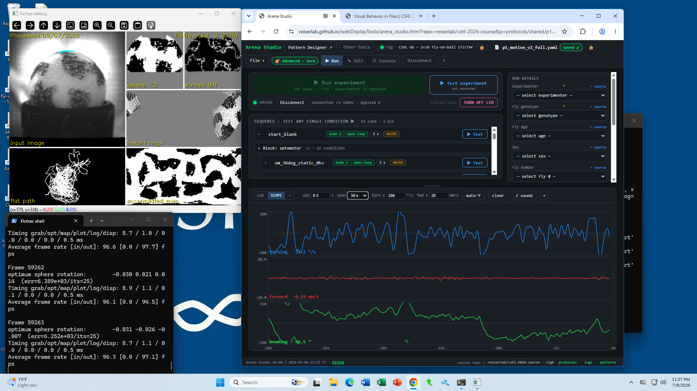

# Arena Studio — getting started

**Arena Studio** is the web app you use to run experiments on the LED arena. It
runs entirely in your browser (Chrome or Edge) — nothing to install.

**Open it:** <https://reiserlab.github.io/webDisplayTools/arena_studio.html>

<div class="arena-studio-overview">
  
</div>

> **Recommended workspace:** Position FicTrac and Arena Studio side by side so
> you can see everything that is happening.

> **Still to add:** isolated screenshots of the Connect dialog, protocol picker,
> and safe-mode indicator.

## Useful links

- **Arena Studio:** <https://reiserlab.github.io/webDisplayTools/arena_studio.html>
- **Course repo:** `reiserlab/cshl-2026-course`
- **Pattern Editor:** <https://reiserlab.github.io/webDisplayTools/pattern_editor.html>
- **Pattern Editor quick start:** <https://github.com/reiserlab/webDisplayTools/blob/main/PATTERN_EDITOR_QUICKSTART.md>

## The three views

A row of buttons at the top switches between three views:

| View | What it's for |
| --- | --- |
| **Run** | Load a protocol and run the whole experiment. This is where you spend most of your time. |
| **Edit** | Build or change a protocol (the designer). **Read-only** for students in safe mode. |
| **Console** | Talk to the arena directly — list patterns, test the display, drive the LED, connect to FicTrac. |

At the bottom of the Run view is a live **oscilloscope** that plots the fly's
turning, forward, and heading in real time while a trial runs — and a green
**CLOSED LOOP** tag appears when a closed-loop trial starts.

## Safe mode (that's you)

By default the Studio opens in **safe mode**: you can view everything and **run**
experiments, but you can't accidentally edit protocols or change patterns. The
🛡 chip in the top bar shows it. That's expected; see **What safe mode blocks**
below.

## Running an experiment — the short version

1. **Open your protocol.** Your instructor will give you a bookmark link (see
   below), or use **File ▾ → Open from Repo…** and pick your protocol.
2. **Connect to the arena.** Click **Connect** and choose the controller's
   serial port when the browser asks. (Chrome/Edge only — this uses Web Serial.)
3. **Connect FicTrac** (fly-on-ball rigs) — start the bridge on the rig computer
   and confirm the scope starts drawing the fly's motion. See
   [FicTrac basics](fictrac.md).
4. **Fill in the run metadata** on the right (experimenter, genotype, sex, age…).
5. **Press Run.** The green button shows the step count and estimated time
   (e.g. `15 steps · ~0:50`). Do a **Test experiment** first to check the fly is
   responsive before the full run.
6. When a **recorded** run completes, its data is committed to GitHub
   automatically — you don't have to save anything. See
   [GitHub for the course](github-overview.md).

**STOP** is always available and blanks the arena immediately. If you stop the
arena early and the red LED is still on, click **Turn off LED** so the fly is
not stimulated outside the experiment.

## Bookmark links (one click per protocol)

Your instructor can hand you a link that opens a specific protocol, in safe
mode, ready to run. Open it in Chrome or Edge on the rig computer. The base
format is:

```
…/arena_studio.html?repo=<owner>/<name>&p=protocols/<bench-id>/<protocol>.yaml
```

- Add options **at the end of the URL**, after the `.yaml` filename. For
  example:

  ```
  …<protocol>.yaml&rig=cshl_g6_2x10_ball&advanced=0
  ```

- `&rig=<rigname>` sets the bench rig.
- `&advanced=0` forces safe mode on a shared machine.
- These links always open in the **Run** view.

Loading a protocol from the private course repo needs you to be **signed in to
GitHub once** on that browser (File ▾ → GitHub). After that, the link just works.

## What safe mode blocks

**Blocked in safe mode:** editing a protocol (the Edit view is read-only),
saving, adding/deleting arena patterns, firmware/panel programming, and bench
setup (rig + GitHub settings are locked).

**Still available:** viewing any protocol, connecting, **running and testing**,
the oscilloscope, Console queries, the display test, driving the LED, and STOP.

Safe mode is a **guardrail, not a lock** — instructors can unlock it when a
team needs to edit a protocol or make a new pattern set.

## Course workflow in one pass

1. Open the assigned protocol from `protocols/shared/`.
2. Run the short version first.
3. If the fly and rig look good, run the matching full version.
4. Check that the completed recorded run appears in `runlogs/<bench-id>/`.
5. After core runs, make or modify a pattern. In the run metadata's **Notes**
   field, add `innovation` plus a short description of what you changed (for
   example, `innovation: female-like pattern, 2 repeats`).

See [Pattern Editor](pattern-editor.md) for the separate pattern-making workflow.

## Troubleshooting

- **"Connect" does nothing / no port list** — you must use **Chrome or Edge**
  (Web Serial isn't in Safari/Firefox). Only one browser tab can hold the port.
- **The scope says "waiting for FicTrac bridge"** — the bridge isn't running or
  isn't connected. See [FicTrac basics](fictrac.md).
- **A link says "sign in… then Open from course repo"** — you're not signed in
  to GitHub on this browser. Do File ▾ → GitHub once.
- **The arena won't take a command** — if the display is running, press **STOP**
  first; some commands are refused while the display is active.

---
*Last updated 2026-07-09.*
