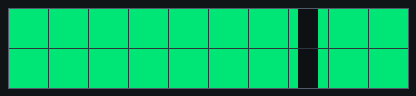

# p0 — Optogenetic intensity calibration

**Goal:** find out how strongly the fly responds to the optogenetic LED at
different brightness levels, while it watches a moving visual pattern. Think of
it as a **dose–response** check: sham (no light) → increasing light levels →
sham again.

**Files:** `p0_opto_intensity_short.yaml` (~2.6 min) and
`p0_opto_intensity_full.yaml` (~10.3 min). Runs on the fly-on-ball rig;
**open-loop** (no FicTrac closed-loop needed).

## Open in Arena Studio

These links open the shared protocol from the private course repository in the
Run view and force safe mode.

| Version | Link |
| --- | --- |
| Short | [Open p0 short](https://reiserlab.github.io/webDisplayTools/arena_studio.html?repo=reiserlab/cshl-2026-course&p=protocols/shared/p0_opto_intensity_short.yaml&rig=cshl_g6_2x10_ball&advanced=0) |
| Full | [Open p0 full](https://reiserlab.github.io/webDisplayTools/arena_studio.html?repo=reiserlab/cshl-2026-course&p=protocols/shared/p0_opto_intensity_full.yaml&rig=cshl_g6_2x10_ball&advanced=0) |

If the browser is not signed in to GitHub yet, Arena Studio will stay in safe
mode and ask you to sign in before loading the protocol.

P0 is the course **intro protocol**. It is not intended to be the main high-N
dataset, but it is useful to run once per genotype/line when possible so each
team sees how Arena Studio, visual stimuli, LED timing, and run logging fit
together.

## Pattern previews

| Drifting grating | Sweeping dark bar |
| --- | --- |
|  |  |

## What the fly sees

Two visual stimuli alternate:

- **Grating** — a square-wave grating (36°/cycle), drifting clockwise then
  counter-clockwise. Drives the optomotor (following) response.
- **Bar** — a 10-pixel dark bar on a bright background that sweeps front-to-back
  (and the reverse), passing through straight-ahead.

Each block runs both, once CW and once CCW.

## What the LED does

Every trial has the same shape: the visual pattern starts, then the **LED turns
on for a fixed window** in the middle of the trial, then off.

- **Grating trials:** 6 s long, LED on from 2–3 s.
- **Bar trials:** 3 s long, LED on from 1.25–1.75 s (centered on the front).

The blocks step the LED through levels while keeping everything else identical:

| Block | LED level |
| --- | --- |
| `sham_pre` | 0% (no light — baseline) |
| `level_1` | 1% (just-on) |
| `level_2` | 5% |
| `level_3` | 10% |
| `level_4` | 20% |
| `level_5` | 40% |
| `sham_post` | 0% (no light — baseline again) |

The sham blocks at the start and end run the **exact same LED command timing**
at 0%, so any change you see across levels is the light, not the timing.

Because the levels are named `level_1 … level_5`, the actual percentages can be
adjusted in one place in the YAML if the calibration changes.

## What to watch

- Does the fly's turning/walking change when the LED comes on?
- At which **level** does a response first appear, and does it saturate?
- Compare `sham_pre` vs `sham_post` — the fly should behave similarly at both if
  it stayed healthy through the run.

## Timing

Short version ≈ **2.6 min** (7 blocks × 1 rep, 1-second blanks between trials).
Full version ≈ **10.3 min** (same design, 4 reps).

Use short first as a sanity check. Do not tune LED levels during the student
short run unless an instructor asks you to; the point is to decide whether the
fly and rig are usable.

## Analysis plots

Planned first-look plots:

- Mean forward velocity and turning around LED onset for each LED level.
- LED dose-response summary by genotype and fly.
- Sham-pre versus sham-post comparison to check whether behavior changed over
  the run.

## References

- Strother JA et al. (2017). The emergence of directional selectivity in the
  visual motion pathway of Drosophila. *Neuron* 94:168-182.
  <https://doi.org/10.1016/j.neuron.2017.03.010>

> **TBD:** add which CsChrimson genotypes to run p0 on, and the final LED-percent
> calibration per rig.

---
*Last updated 2026-07-09. Source: `protocols/shared/p0_opto_intensity_*.yaml`.*
