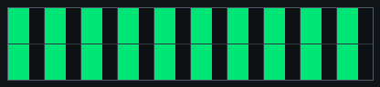
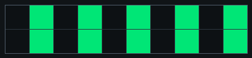
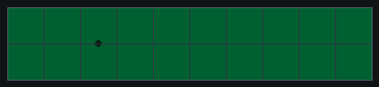
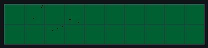

# p1 — Visual motion (optomotor + looming)

**Goal:** measure how the fly responds to **wide-field motion** (optomotor
turning) and to **looming** stimuli (approaching objects that trigger
avoidance/escape). Each trial also starts with a brief optogenetic pulse.

**Files:** use the revised `p1_motion_v2_short.yaml` (~2.7 min) and
`p1_motion_v2_full.yaml` (~7.9 min). Fly-on-ball rig; **open-loop** visual
stimulation. FicTrac is still recorded for behavior, but the fly does not steer
the display in this protocol.

## Open in Arena Studio

These links open the shared protocol from the private course repository in the
Run view and force safe mode.

| Version | Link |
| --- | --- |
| Short | [Open p1 short](https://reiserlab.github.io/webDisplayTools/arena_studio.html?repo=reiserlab/cshl-2026-course&p=protocols/shared/p1_motion_v2_short.yaml&rig=cshl_g6_2x10_ball&advanced=0) |
| Full | [Open p1 full](https://reiserlab.github.io/webDisplayTools/arena_studio.html?repo=reiserlab/cshl-2026-course&p=protocols/shared/p1_motion_v2_full.yaml&rig=cshl_g6_2x10_ball&advanced=0) |

If the browser is not signed in to GitHub yet, Arena Studio will stay in safe
mode and ask you to sign in before loading the protocol.

## Pattern previews

### Optomotor gratings

| 36° spatial period | 72° spatial period |
| --- | --- |
|  |  |

### Looming and loom controls

| Expanding dark disc | Expanding annulus | Multi-dot control |
| --- | --- | --- |
|  |  |  |

## The optogenetic prestim

Every visual trial begins with a **0.5 s LED pulse at 25%** while the pattern is
held on its first frame. The LED then turns **off** for the moving stimulus. So
each trial is "brief light, then motion."

## What the fly sees

- **Optomotor gratings** — drifting gratings at **2 spatial periods** and
  several speeds, in both directions (CW/CCW). A fly tends to turn *with* the
  motion. In v2, each spatial period includes a static (0 Hz) condition plus
  moving conditions paired at matched temporal frequencies.
- **Looming** — expanding dark stimuli that simulate an approaching object, at
  **3 classes × 5 positions × 2 speeds**. These probe avoidance/escape-like
  behavior. The loom files include duplicated final frames so the image holds
  steady at maximum size instead of rolling over.

## Looming stimulus logic

A looming stimulus is an expanding object on the visual panorama. To the fly,
this can approximate an object approaching on a collision course. The main p1
loom is therefore a dark expanding disc, inspired by work on looming-responsive
visual pathways such as LC6.

P1 also includes stimulus controls. The expanding annulus keeps an expanding
edge but reduces the sustained dark area. The multi-dot control tests whether
responses depend on one coherent object or can also be driven by local dark
features distributed across the same region. These controls are deliberate:
stimulus controls are treated as seriously as genetic controls, because they
help separate "the fly detected an approaching object" from simpler explanations
such as local darkening, edge motion, position, or final image state.

## Trial counts (v2 full)

| Component | Design |
| --- | --- |
| Optomotor | 2 spatial periods × (1 static + 5 temporal frequencies × 2 directions) × 3 reps = **66** trials |
| Looming | 3 stimulus classes × 5 positions × 2 speeds × 3 reps = **90** trials |

Trials run in a fixed, paired order: opposite-direction optomotor trials and
left/right looms are adjacent. A static gray background is shown between trials
instead of blanking the arena.

## What to watch

- **Optomotor:** does the fly turn in the direction of grating motion? Does the
  strength depend on speed / spatial period?
- **Looming:** does the fly react (turn away, freeze, or attempt escape) as the
  object expands? Does position matter?

## Timing

Short version ≈ **2.7 min**. Full version ≈ **7.9 min** before setup/metadata
overhead.

Run short first. If the fly is walking and the responses look interpretable, run
the full version on the same fly. If both are usable, they can be pooled in
analysis.

## Analysis plots

Planned first-look plots:

- Optomotor turning traces with CW and CCW directions shown separately.
- Optomotor response matrices: rows = spatial period, columns = temporal
  frequency.
- Looming response matrices: rows = stimulus class, columns = loom speed, with
  left/front/right positions shown separately or facet-labeled.
- Average forward velocity from the start of the experiment, using a centered
  0.5 s window.

## References

- Morimoto MM, Nern A, Zhao A, Rogers EM, Wong AM, Isaacson MD, Bock DD,
  Rubin GM, Reiser MB (2020). Spatial readout of visual looming in the central
  brain of Drosophila. *eLife* 9:e57685.
  <https://elifesciences.org/articles/57685>
- Strother JA et al. (2017). The emergence of directional selectivity in the
  visual motion pathway of Drosophila. *Neuron* 94:168-182.
  <https://doi.org/10.1016/j.neuron.2017.03.010>

> **TBD:** add which genotypes run P1 first and which P1 runs count toward the
> class aggregate.

---
*Updated 2026-07-10 01:47 ET. Source: `protocols/shared/p1_motion_v2_*.yaml`.*
