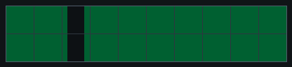
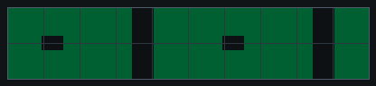
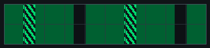
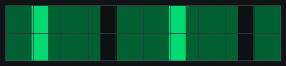
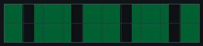
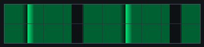
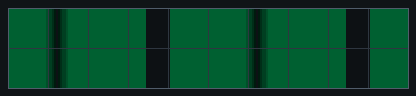

# p2 — Object responses (fixation + choice)

**Goal:** study how the fly responds to a **vertical bar/object** — both when it
can **steer the object itself** (closed-loop fixation) and when it must **choose
between two objects** (A/B choice) — with and without optogenetic activation.

**Files:** `p2_object_tonic_short.yaml` / `p2_object_tonic_full.yaml` and
`p2_object_burst_short.yaml` / `p2_object_burst_full.yaml`. Fly-on-ball rig.
**Requires [FicTrac](../fictrac.md)** — this protocol uses **closed-loop**
control. Everyone should run a P2 version; the instructor will assign tonic,
burst, or both.

**Canonical genotype:** a male **P1 > CsChrimson** or **pC1 > CsChrimson** fly.
Activating either circuit should make males more interested in visual objects.

## Open in Arena Studio

These links open the shared protocol from the private course repository in the
Run view and force safe mode. Use the tonic or burst version assigned to your
team.

| Version | Link |
| --- | --- |
| Tonic short | [Open p2 tonic short](https://reiserlab.github.io/webDisplayTools/arena_studio.html?repo=reiserlab/cshl-2026-course&p=protocols/shared/p2_object_tonic_short.yaml&rig=cshl_g6_2x10_ball&advanced=0) |
| Tonic full | [Open p2 tonic full](https://reiserlab.github.io/webDisplayTools/arena_studio.html?repo=reiserlab/cshl-2026-course&p=protocols/shared/p2_object_tonic_full.yaml&rig=cshl_g6_2x10_ball&advanced=0) |
| Burst short | [Open p2 burst short](https://reiserlab.github.io/webDisplayTools/arena_studio.html?repo=reiserlab/cshl-2026-course&p=protocols/shared/p2_object_burst_short.yaml&rig=cshl_g6_2x10_ball&advanced=0) |
| Burst full | [Open p2 burst full](https://reiserlab.github.io/webDisplayTools/arena_studio.html?repo=reiserlab/cshl-2026-course&p=protocols/shared/p2_object_burst_full.yaml&rig=cshl_g6_2x10_ball&advanced=0) |

If the browser is not signed in to GitHub yet, Arena Studio will stay in safe
mode and ask you to sign in before loading the protocol.

## Pattern previews

### Single object

| Closed-loop stripe / sweep object |
| --- |
|  |

### Object-choice patterns

| Small object | Barberpole | Bright bar |
| --- | --- | --- |
|  |  |  |

| Dark bar | Graded edge | Contrast peak |
| --- | --- | --- |
|  |  |  |

## Two optogenetic variants

The visual design is the same; the variants differ only in *how* the LED is
delivered. Some male P1/pC1 activation flies become inactive under continuous
stimulation, so the burst version provides a more transient alternative:

- **`burst`** — a **0.5 s LED pulse before each trial** (while the first frame
  is held), then LED off for the trial. Default LED level: **35%**.
- **`tonic`** — the LED is turned **on once and held** through the whole
  optogenetic phase. Default LED level: **15%**.

Pick the one your instructor specifies.

## Structure (in order)

1. **Start:** a gray background (3 s).
2. **No-opto, closed-loop stripe:** a dark vertical stripe is placed in front of
   the fly and **FicTrac-controlled** — the fly's turning moves the stripe, so
   it can "fixate" it. 3 × 20 s.
3. **No-opto sweeps (open-loop):** the bar sweeps ±90° across the front (CW
   starts at −90°, CCW at +90°, both pass through front midway), at 3 speeds
   (36 / 72 / 144 °/s), LED off.
4. **Opto sweeps:** the same sweep set, now with optogenetic light (burst or
   tonic).
5. **Opto closed-loop stripe:** the front-stripe fixation again, with light.
6. **Opto A/B choice (closed-loop):** two objects presented; the fly steers
   between them. 6 combinations, each repeated, about 15 s per trial. Each combo has
   B-left and B-right versions to balance side bias.

## What to watch

- **Fixation:** does the fly hold the stripe in front (keep it centered) when it
  controls it in closed loop?
- **Sweeps:** does it track/turn with the moving bar, and does light change that?
- **Choice:** does the fly prefer object A or B? Does optogenetic activation
  shift the preference? (Frame it neutrally — don't assume which object is
  "better"; let the data tell you.)

## Timing

| Version | Approximate runtime |
| --- | ---: |
| `p2_object_tonic_short` | 4.3 min |
| `p2_object_tonic_full` | 9.8 min |
| `p2_object_burst_short` | 4.5 min |
| `p2_object_burst_full` | 10.2 min |

Full runs contain about 1 min no-opto fixation, about 0.9 min no-opto sweeps,
about 0.9 min opto sweeps, about 1 min opto fixation, and about 6 min A/B
choice, plus the per-trial LED bursts in the burst version.

## Before you run

- **FicTrac must be connected** (bridge running) or the closed-loop blocks won't
  work — confirm the oscilloscope shows live motion first.
- Frame 0 of the bar is centered on the **calibrated front column** established
  in p1 — make sure the front calibration is current for this rig.
- Run the short version first. If the same fly then completes the full version,
  both can be pooled in analysis.

## Analysis plots

Planned first-look plots:

- Closed-loop stripe position and fly turning during no-opto versus opto
  fixation.
- Open-loop sweep responses by speed and direction.
- Object-choice occupancy/preference for each A/B combination, with B-left and
  B-right versions combined only after checking side bias.
- Forward velocity over the run, using a centered 0.5 s window.

## References

- Horn E (1978). The mechanism of object fixation and its relation to
  spontaneous pattern preferences in Drosophila melanogaster.
  <https://doi.org/10.1007/BF00337000>
- Cheng KY, Frye MA (2021). Odour boosts visual object approach in flies.
  <https://doi.org/10.1098/rsbl.2020.0770>

> **Rig alignment:** in the course arenas, **column 3 is directly in front** and
> **column 8 is directly behind**. Confirm that frame 0 of the closed-loop bar
> is aligned to column 3 before collecting P2 data.

---
*Updated 2026-07-10 02:28 ET. Source: `protocols/shared/p2_object_*.yaml`.*
