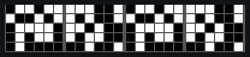

# p3 — The Heisenberg experiment (closed-loop conditioning)

**Goal:** ask whether a walking fly learns to avoid one visual orientation when
entering that part of its closed-loop panorama triggers LED/laser stimulation.
P3 is a tribute to Martin Heisenberg, Reinhard Wolf, Marcus Dill, Aike Guo, and
the flight-simulator lineage they developed.

**Status:** the five-pattern stimulus set is built. Short/full YAML files will
be added after the new conditional LED feature passes a physical-rig test and
the instructor chooses the reinforcement genotype and safe light level.

**Planned files:** `p3_conditioning_closedloop_short.yaml` (≈8 min) and
`p3_conditioning_closedloop_full.yaml` (≈18 min). Fly-on-ball rig. **Requires
[FicTrac](../fictrac.md)** and the Arena Studio web runner.

## Pattern previews

Each movie has cue A twice and cue B twice, alternating every 90 degrees. Pick
one pattern pair before the run and use it throughout baseline, training, and
the no-light probe.

| 1. Classic T figures | 2. High/low bars | 3. Left/right slashes |
| --- | --- | --- |
|  |  |  |

| 4. Relational slashes | 5. Dill random squares |
| --- | --- |
|  |  |

## The historical pattern menu

| ID | Student choice | What differs |
| ---: | --- | --- |
| 1 | Classic T figures | Upright versus inverted T |
| 2 | High/low bars | Vertical position |
| 3 | Left/right slashes | +45° versus -45° edge orientation |
| 4 | Relational slashes | Which slash orientation is above the other |
| 5 | Dill random squares | Two randomized, quadrant-filling square textures |

The T figures use the classic approximately 40° figure size and 14° bar width.
The checker texture uses 12.6° checks with 1.8° gaps, the closest whole-pixel G6
match to Dill et al.'s 12.9° checks and 1° gaps. Its first 180° are repeated
over the second 180°, as in the paper.

## Pattern choice in the protocol

The planned YAML exposes two linked variables:

```yaml
pattern_name: &pattern_name "p3_heisenberg_ts"
pattern_id: &pattern_id 1
```

Change both from the table above. Arena Studio resolves the pattern by name and
uses `pattern_ID` as the SD-card fallback; keeping the pair matched prevents a
wrong-pattern fallback. The run log must record both values so class analysis
can group flies by stimulus family.

## What the fly controls

All five patterns use the same 200-frame coordinate system:

- cue A is centered in front at frames 25 and 125;
- cue B is centered in front at frames 75 and 175;
- each frame is 1.8° and each 50-frame quadrant is 90°;
- FicTrac turning moves the panorama in Mode 3 closed loop.

The instructor also assigns whether cue A or cue B is reinforced,
counterbalanced across flies. Pattern choice and reinforced cue are separate
experimental variables.

## What the LED/laser does

During training, Arena Studio's `led_activation` watches the live displayed
frame index and turns the BuckPuck-driven LED/laser on only in the assigned
quadrants:

| Reinforced cue | Inclusive on-ranges |
| --- | --- |
| Cue A | `[[0, 49], [100, 149]]` |
| Cue B | `[[50, 99], [150, 199]]` |

Baseline and probe blocks use the same visual pattern with stimulation off.
The light is forced off at each trial boundary and every transition is recorded
in the run log.

## Planned structure

### Short pilot (~8 min)

1. Closed-loop baseline, stimulation off — 2 min.
2. Closed-loop training, stimulation gated by orientation — 4 min.
3. Closed-loop probe, stimulation off — 2 min.

### Full experiment (~18 min)

1. Closed-loop baseline — 4 min, analyzed as two 2-min bins.
2. Training 1 — 4 min.
3. Probe 1 — 2 min.
4. Training 2 — 4 min.
5. Final probe — 4 min, analyzed as two 2-min bins.

This follows the standard timing used in the classic flight-simulator work. An
optional later comparison will use fixed open-loop cue presentations alternating
every 3 s, followed by the same closed-loop probe.

## What to watch

- During training, does the fly leave reinforced sectors and remain longer in
  unreinforced sectors?
- During the no-light probe, does that orientation preference persist?
- Does the result depend on which historical pattern pair the student chose?
- Is apparent preference actually long immobility? Inspect walking fraction
  and dwell times together with occupancy.

## Analysis plots

- Full 200-bin displayed-frame-index occupancy for every baseline/probe bin.
- Cue-aligned quadrant occupancy and the classic preference index:
  `(time safe - time reinforced) / total time`.
- Baseline-corrected probe preference per fly and across training cycles.
- Dwell-time distributions in reinforced and safe quadrants.
- LED-transition events overlaid on training arena index.
- Forward velocity, turning velocity, moving fraction, and immobility QC.
- Class summary grouped by `pattern_name`, reinforced cue, genotype, and sex.

## Why these five patterns?

- Upright/inverted T figures are the canonical Wolf-Heisenberg landmarks.
- High/low bars reduce the problem to vertical position.
- Opposite slashes test the robust edge-orientation feature.
- The two-slash pair tests a relational cue: which orientation is above which.
- Random squares honor Dill's highly learnable full-field texture experiment
  and test learning without a single compact landmark.

## References

- Heisenberg M, Wolf R (1984). *Vision in Drosophila: Genetics of
  Microbehavior*. <https://doi.org/10.1007/978-3-642-69936-8>
- Wolf R, Heisenberg M (1991). Basic organization of operant behavior as
  revealed in Drosophila flight orientation.
  <https://doi.org/10.1007/BF00194898>
- Dill M, Wolf R, Heisenberg M (1995). Behavioral analysis of Drosophila
  landmark learning in the flight simulator.
  <https://doi.org/10.1101/lm.2.3-4.152>
- Guo A, Liu L, Xia S-Z, Feng C-H, Wolf R, Heisenberg M (1996). Conditioned
  visual flight orientation in Drosophila: dependence on age, practice, and
  diet. <https://doi.org/10.1101/lm.3.1.49>
- Brembs B, Heisenberg M (2000). The operant and the classical in conditioned
  orientation of Drosophila melanogaster at the flight simulator.
  <https://doi.org/10.1101/lm.7.2.104>
- Tang S, Wolf R, Xu S, Heisenberg M (2004). Visual pattern recognition in
  Drosophila is invariant for retinal position.
  <https://doi.org/10.1126/science.1099839>

> **Bench gate:** do not release P3 to students until conditional LED
> activation, cue/front phase, firmware version, safe stimulation level, and
> run-log events have been verified on a physical rig.

---
*Last updated 2026-07-09. Pattern source: `patterns/p3_conditioning/`.*
