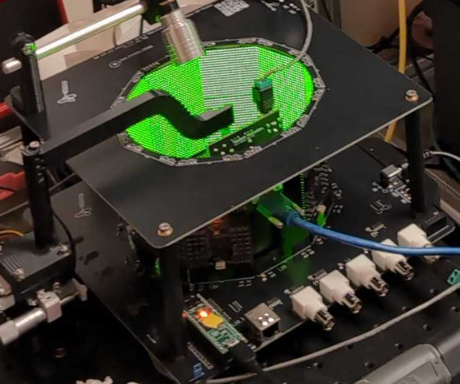
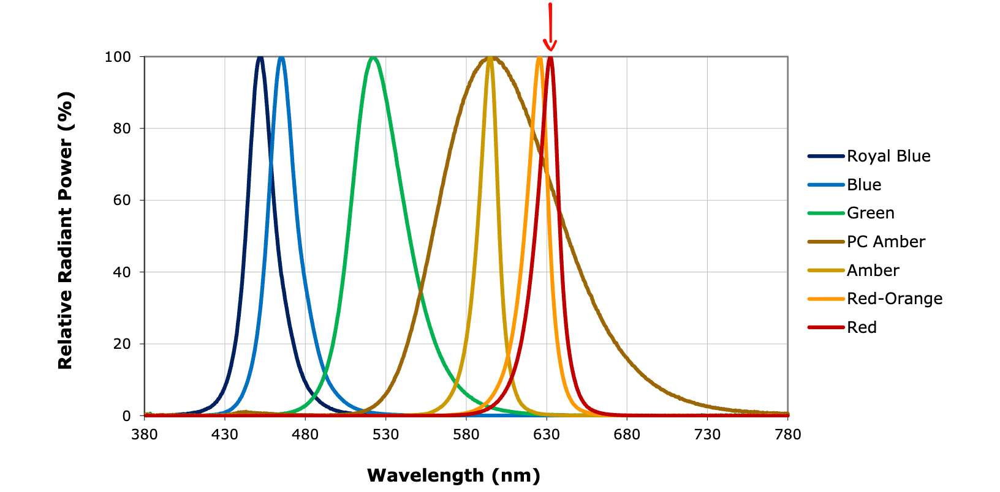

# Rig 101 — what's on the bench

Each bench is a **fly-on-ball LED-arena rig**. A tethered fly walks on an
air-supported ball at the center of a cylinder of LED panels; the panels show
visual patterns, a camera watches the ball to measure how the fly walks, and an
LED delivers optogenetic light. Here's each piece.

> **New system, feedback welcome.** These rigs are less than a month old, and
> much of the software running them, including Arena Studio, is only about 10
> days old. Feedback about the hardware, experiments, software, or instructions
> will help us improve the course quickly. Please tell an instructor or [open a
> course feedback issue](https://github.com/reiserlab/cshl-2026-course/issues/new?title=Course%20feedback%3A%20).

## The LED arena (the panels)

  

- **G6 panels**, arranged in **2 rows × 9 physical columns**
  (`arena: G6_2x10`). The nominal G6 model spans 10 columns, but these course
  rigs leave one column open **directly behind the fly** for the camera cable.
  The physical display is therefore not a full 360° ring; most arena
  configurations use a complete ring.
- Each panel is 20 × 20 pixels. Patterns use a nominal **200-pixel azimuth**
  coordinate system and are 40 pixels tall; one virtual column corresponds to
  the camera gap.
- Patterns are `.pat` files stored on the controller's SD card. Arena Studio's
  Console lists them and can play/test any one.

> **Course SD card:** Copy the 45 `.pat` files directly from the course
> repository's [shared pattern library](https://github.com/reiserlab/cshl-2026-course/tree/main/patterns)
> to the SD-card root. Do not combine the source or separate protocol pattern
> folders; the shared protocol YAMLs use the library's global IDs.

## The arena controller and I/O

The controller is not a separate box. A **Teensy microcontroller** sits
directly on the arena PCB and drives the panels, the optogenetic LED, and the
digital/analog I/O. The arena is a single, self-contained experimental system:
it needs only a **5 V power supply** and a **USB connection to the PC**. Open
Arena Studio in **Google Chrome or Microsoft Edge**, then press **Connect** to
reach the arena.

## The optogenetic LED (light stimulus)

Optostim is a low-cost, highly adjustable module built from a high-power red
LED and a few simple 3D-printed parts: a mount, an adjustable slider, and a
light guide. Together they provide precise positioning and full control over
the direction of stimulation, so the light can be aimed reproducibly at the
fly.

  

- The red arrow marks the LED used for optogenetic stimulation.
- It's driven from the controller's **Analog Out (0–5 V) BNC** through a
  **BuckPuck/LuxDrive** current driver. The driver is *inverted*: lower voltage
  = brighter.
- The rig **idles the Analog Out at 5 V (LED off)**. Protocols set brightness as
  a **percent** (`ledDrive`), which Arena Studio converts to the right voltage.
- Use the LED levels specified in the assigned protocol.

## The fly-on-ball tracker (FicTrac)

The fly walks on a lightweight foam ball floated on a gentle stream of air; a
camera watches the ball, and **FicTrac** software turns its rotation into the
fly's **turning, forward, and sideways** motion. This is the inexpensive
"spherical treadmill" from [Loesche & Reiser 2021](https://doi.org/10.3389/fnbeh.2021.689573).

- **Ball:** a ~**9 mm** foam sphere (`ball_diameter_mm: 9`) with a hand-marked,
  asymmetric pattern so FicTrac can tell every orientation apart. The diameter
  is what converts ball rotation into mm/s.
- **Air support:** a 3D-printed cup/holder floats the ball. Flow is set with a
  regulator + a **3D-printed roller clamp**. Too much flow → the ball
  jitters/spins wildly; too little → it sinks.
  Aim for a gentle, stable float.
- **Camera + light:** a **FLIR Firefly S USB3 monochrome camera** images the
  ball through an S-mount lens under **near-infrared** light — invisible to the
  fly, so it doesn't pollute the visual stimulus.
- **Treadmill illumination:** near-infrared LEDs illuminate the ball without
  flicker from PWM, so the camera can track it without adding visible light to
  the visual stimulus.
- **Bridge:** a small program relays FicTrac's motion to Arena Studio for the
  live oscilloscope and for **closed-loop** experiments (the fly steers the
  display). Full setup: **[FicTrac basics & config](fictrac.md)**.

## Positioning the fly

The tether clamps into an inexpensive but excellent **micromanipulator** above
the ball. It provides fine, sub-millimeter positioning along the three
translational axes, which is essential for placing a small fly carefully on the
treadmill.

- Center the fly over the ball and set its height so the legs reach and grip it.
- Adjust fore-aft and left-right position so the fly is stable and comfortable.
- Align the body and **gaze direction** with the arena. Small errors in any axis
  can make the visual alignment or walking behavior harder to interpret.

Careful alignment takes practice: the fly must be positioned and oriented in
several dimensions, not merely lowered onto the ball.

## The tethering station

Next to the rig is the **tethering station**: a Peltier-cooled platform (the
"sarcophagus") under a dissecting scope, with a micromanipulator to lower the
tether onto the fly. Flies are chilled on ice and glued to a pin here before
going on the ball — see **[Tethering basics](tethering.md)**. The
[Fly Lab Gear tethering-station guide](https://reiserlab.github.io/Fly-Lab-Gear/tether/station)
has the station design and component documentation.

## Digital I/O BNCs

- Two **"Digital IO (5V)"** BNCs are integrated on the arena PCB. On course
  rigs, IO 1 carries a frame-scan debug pulse (handy on a scope) and IO 2 is
  off by default. You won't normally touch these.

## Two rig flavors

- **`cshl_g6_2x10_ball`** — the fly-on-ball rig (has FicTrac). Most experiments.
- **`cshl_g6_2x10`** — the same arena *without* FicTrac (used for
  hardware checkout like [p100](protocols/README.md)).

Arena Studio uses the rig's config to know what's present — e.g. it only offers
FicTrac closed-loop on a rig that actually has a ball tracker.

## Reference

- Modular LED Display repository: <https://github.com/reiserlab/Modular-LED-Display>
- webDisplayTools repository: <https://github.com/reiserlab/webDisplayTools>
- G6 Pattern Editor: <https://reiserlab.github.io/webDisplayTools/pattern_editor.html>
- Loesche & Reiser (2021), *An Inexpensive, High-Precision, Modular Spherical
  Treadmill Setup Optimized for Drosophila Experiments*:
  [doi:10.3389/fnbeh.2021.689573](https://doi.org/10.3389/fnbeh.2021.689573).
- Isaacson MD et al. (2022), *A high-speed, modular display system for diverse
  neuroscience applications*:
  [doi:10.1101/2022.08.02.502550](https://doi.org/10.1101/2022.08.02.502550).

---
*Updated 2026-07-10 02:30 ET.*
