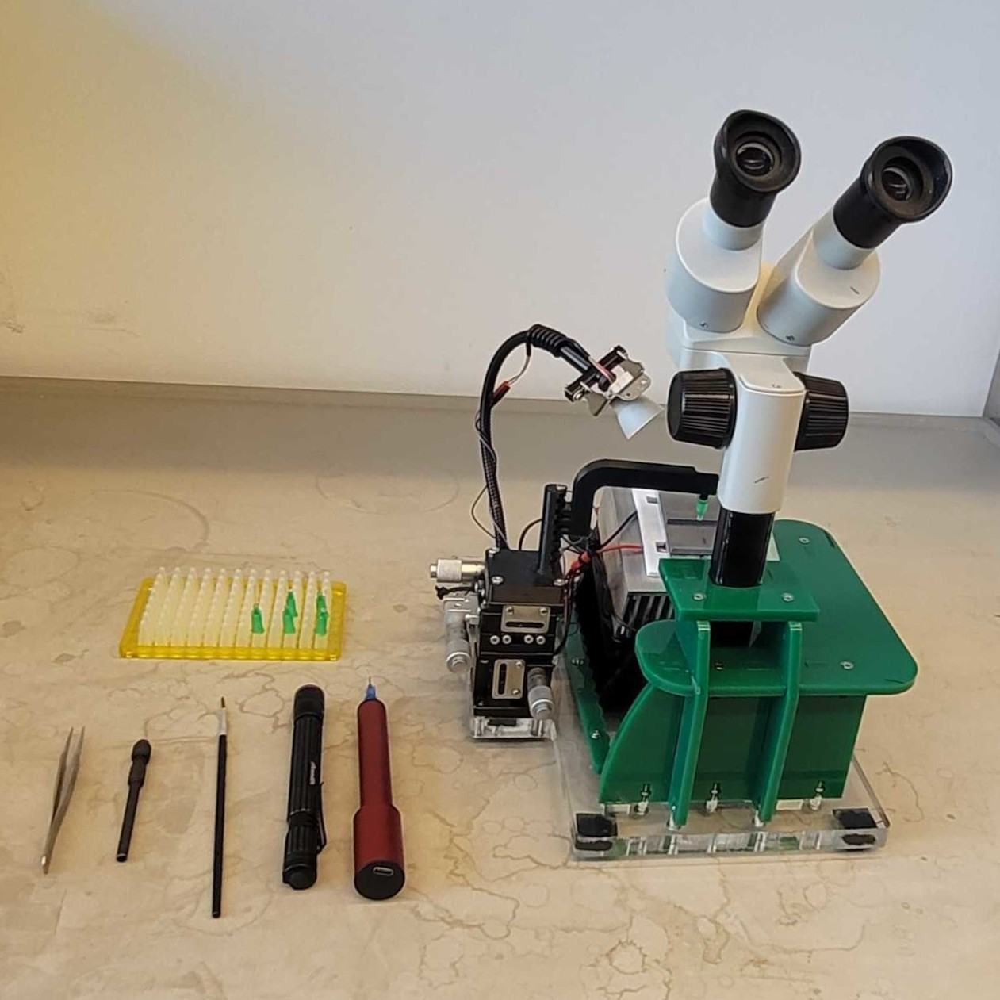

# Tethering basics

  
  Photo by Frank Loesche

To record a fly on the ball you first glue it to a small pin (the "tether") so
its head and body are held still while its legs walk freely. Tethering is a
craft — the single biggest factor in getting clean data. A well-tethered, happy
fly gives you hours of behavior; a crooked or over-glued one won't walk.

The [Fly Lab Gear tethering-station guide](https://reiserlab.github.io/Fly-Lab-Gear/tether/station)
has the station design, hardware details, and source files.

## The idea

- Flies are **cold-anesthetized on ice** — no CO₂. Below about **4.5 °C**, they
  stop moving within minutes; when they warm up, they recover and begin moving
  again. Keep them cold while you work, then let them warm to wake.
- You glue **only the top of the thorax** to the tether. Head, legs, wings, and
  abdomen stay **free**.
- **Minimal glue.** *If you never lose a fly because it breaks free, you're
  using too much glue.*

## What you need

Tethers (pins), a micromanipulator plus a Peltier-cooled tethering platform
(the "sarcophagus"), light-curing glue plus a curing LED, a glass slide, a pin
vice, a fine paintbrush, a vacuum pen, Kimwipes, and a dissecting scope.

## Prepare the flies

1. Get a vial; **note the genotype and estimated age** in your notebook.
2. Transfer a few flies into a tube; plug it with cotton/foam. *Every fly is
   precious* — ask for small batches. A [transfer funnel](https://reiserlab.github.io/Fly-Lab-Gear/tether/funnels)
   may help.
3. **Chill on ice** until fully immobilized (~5 min). Do not leave them on ice
   longer than necessary: a longer chill means a longer recovery before the fly
   is ready to walk.

## Prepare the station

1. Power the station; confirm the platform is getting **cold**.
2. Lay a small Kimwipe square on the cold sarcophagus to soak up condensation.
3. Put a drop of light-curing glue on a glass slide.
4. Mount a tether on the micromanipulator and **practice moving it** — smooth,
   controlled motion is half the battle.

## Tether a fly

1. Check the flies are immobile and the platform is very cold. Dab away any
   condensation with a twisted Kimwipe point.
2. Scatter a few chilled flies onto the Kimwipe on the platform.
3. **Pick a good candidate:** a large, healthy fly, completely still, wings
   folded back and legs tucked into a neat "hexagon."
4. With the **vacuum pen**, move it into a sarcophagus cavity, **head pointing
   away** from you. Nudge it with the paintbrush until the body is straight and
   you're looking **straight down on the thorax**.
5. With the **pin vice**, place a **small drop of glue on the top ⅓ of the
   thorax** (not on the head, wings, or leg joints).
6. **Lower the tether** into the glue with the micromanipulator — touch the
   glue, don't crush the fly.
7. **Cure** the glue with the LED.
8. **Lift** the fly off with the micromanipulator and set it on the waiting
   plate. It should **wake and start moving within a minute**.

## Good vs. bad tether

| ✅ Good | ❌ Bad |
| --- | --- |
| Tiny glue drop, thorax only | Glue on legs, wings, joints, or head |
| Head free, body straight, level | Fly cocked to one side / head glued |
| Wakes and walks within ~1 min | Slow/no recovery (usually too much glue or too cold too long) |

## Mount on the ball

1. Clamp the tether in the rig holder so the fly is **centered over the ball**.
2. Lower until the legs just reach the ball and it grips and starts to walk.
3. Confirm it walks: the ball turns under it, and once
   [FicTrac](fictrac.md) is running you'll see motion on the oscilloscope.

## Practice first

Tethering takes reps — everyone should tether several practice flies before
touching experimental ones. Time spent here pays off in every experiment after.

## Reference

- Loesche & Reiser (2021), *An Inexpensive, High-Precision, Modular Spherical
  Treadmill Setup Optimized for Drosophila Experiments*:
  [doi:10.3389/fnbeh.2021.689573](https://doi.org/10.3389/fnbeh.2021.689573).

---
*Updated 2026-07-10 01:47 ET.*
